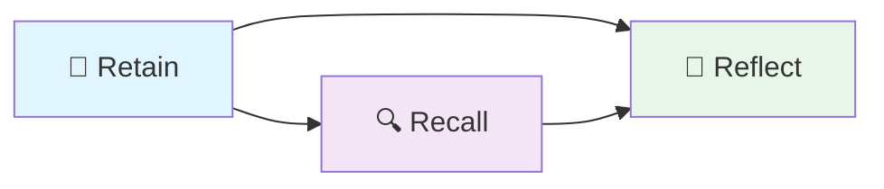
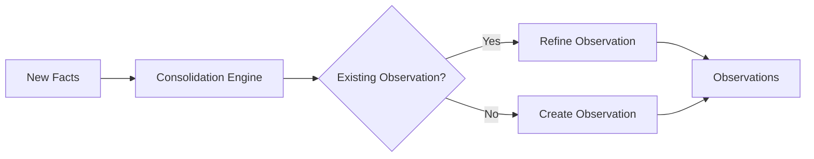
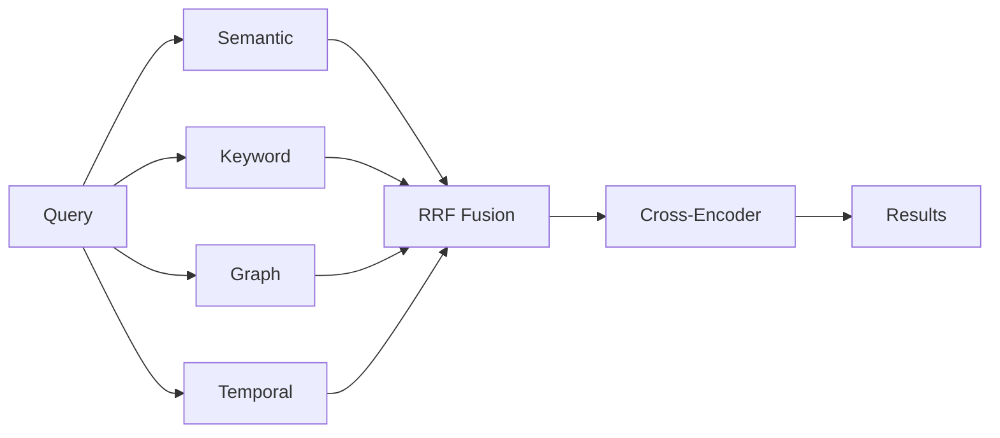
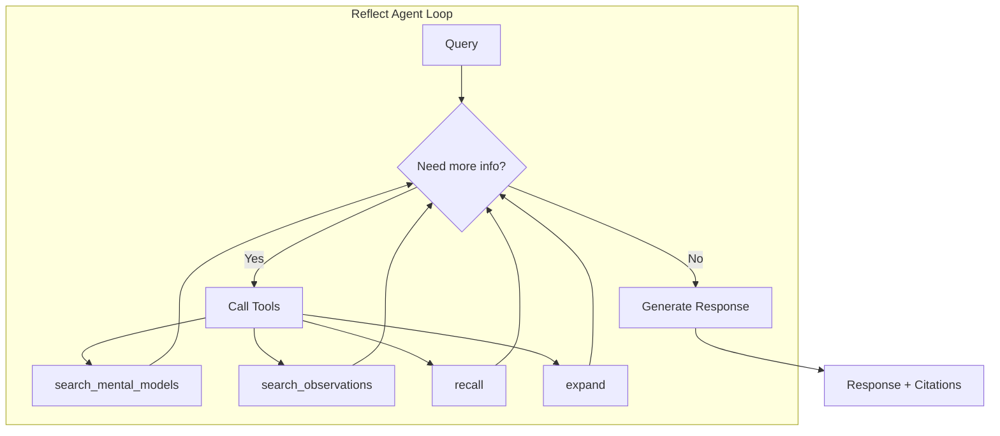

# RAG vs Memory

Traditional RAG (Retrieval-Augmented Generation) retrieves documents similar to a query. Hindsight provides structured memory with temporal reasoning, entity understanding, and belief formation.

## Capability Comparison

| Capability | RAG | Hindsight |
|------------|-----|-----------|
| **Search strategy** | Semantic similarity only | Semantic + keyword + graph + temporal |
| **Multi-hop reasoning** | Limited to retrieved chunks | Graph traversal across entity relationships |
| **Temporal queries** | Keyword matching ("spring") | Date parsing and range filtering |
| **Entity understanding** | None | Entity resolution, co-occurrence tracking |
| **Knowledge consolidation** | Stateless | Mental models that synthesize and evolve |
| **Disposition** | None | 3 traits (skepticism, literalism, empathy) influence interpretation |

## Architecture Comparison

### RAG

| Step | Operation |
|------|-----------|
| 1 | Embed query |
| 2 | Vector similarity search |
| 3 | Return top-k chunks |
| 4 | Generate response |

Single retrieval strategy. No state between queries.

### Hindsight

| Step | Operation |
|------|-----------|
| 1 | Parse query (extract temporal expressions, entities) |
| 2 | Execute 4 parallel retrievals: semantic, BM25, graph, temporal |
| 3 | Fuse results with RRF |
| 4 | Rerank with cross-encoder |
| 5 | Apply disposition traits |
| 6 | Generate response |

Multiple retrieval strategies. Persistent state across sessions.

## Example Scenarios

### Multi-Hop Reasoning

**Stored facts:**
- "Alice is the tech lead on Project Atlas"
- "Project Atlas uses Kubernetes"
- "Kubernetes cluster had an outage Tuesday"

**Query:** "Was Alice affected by recent issues?"

| System | Result |
|--------|--------|
| RAG | Retrieves facts about Alice only (no semantic similarity to "issues") |
| Hindsight | Traverses Alice → Project Atlas → Kubernetes → outage via entity links |

### Temporal Queries

**Stored facts with timestamps:**
- March: "Alice started microservices migration"
- April: "Alice completed auth service"
- October: "Alice focusing on performance"

**Query:** "What did Alice do last spring?"

| System | Result |
|--------|--------|
| RAG | Returns all Alice facts regardless of date |
| Hindsight | Parses "last spring" → March-May, filters to that range |

### Entity Understanding

**Stored facts about a user across sessions:**
- "Pro subscription"
- "Mobile app crashes in settings"
- "Switched to annual billing"
- "Desktop app working fine"

**Query:** "What do you know about my account?"

| System | Result |
|--------|--------|
| RAG | Lists disconnected facts |
| Hindsight | Returns connected facts via entity graph: subscription status, billing, known issues |

### Knowledge Evolution

**Week 1:** User struggles with async Python, succeeds with threads
**Week 3:** User asks about asyncio, implements async database calls

| System | Behavior |
|--------|----------|
| RAG | No memory of progression |
| Hindsight | Consolidates mental model "user prefers sync" → refines to "user growing comfortable with async" |

## When to Use Each

| Use Case | Recommended |
|----------|-------------|
| Document Q&A over static corpus | RAG |
| Search with no temporal requirements | RAG |
| AI assistants with persistent memory | Hindsight |
| Applications requiring entity tracking | Hindsight |
| Systems needing consistent disposition | Hindsight |
| Temporal queries ("last month", "in 2023") | Hindsight |


---
sidebar_position: 10
---

# How Hindsight Works: A Complete Guide

*A plain-English explanation of the math, algorithms, and ideas behind Hindsight — written for curious minds who want to understand what's happening under the hood.*

---

## Who This Guide Is For

You don't need a PhD to understand how Hindsight works. If you've ever:

- Organized a filing cabinet
- Looked something up in a textbook index
- Asked a friend "do you remember when...?"

Then you already have the intuition for everything in this guide. We'll build from those everyday experiences to explain the real math and algorithms that power Hindsight's memory system.

---

## Part 1: The Big Picture

### What Problem Are We Solving?

Imagine you're building an AI assistant for a company. After chatting with hundreds of users over months, the assistant has accumulated thousands of conversations. When a user asks "What did we decide about the database migration?", the assistant needs to:

1. **Find** the right memories among thousands
2. **Understand** which ones are relevant to *this* question
3. **Synthesize** an answer that accounts for how decisions evolved over time

Most AI systems solve this by dumping recent conversations into context — like reading the last 20 pages of a diary. But that doesn't work when the answer is buried in a conversation from three months ago.

Hindsight solves this differently. Instead of just remembering conversations, it **learns** from them — extracting facts, building connections, and synthesizing knowledge over time. Think of the difference between a student who only re-reads their notes versus one who creates flashcards, draws concept maps, and writes summaries.

### The Three Operations

Everything Hindsight does falls into three operations:



| Operation | What It Does | Real-World Analogy |
|-----------|-------------|-------------------|
| **Retain** | Store new information, extract facts, build connections | Taking notes in class, then organizing them into your binder |
| **Recall** | Find relevant memories for a question | Searching your notes, index cards, and textbook at the same time |
| **Reflect** | Reason about memories to answer complex questions | Writing an essay using your research materials |

Let's dive deep into each one.

---

## Part 2: Retain — How Memories Are Stored

### From Conversations to Facts

When Hindsight receives new information (a conversation, a document, a note), it doesn't just store the raw text. It breaks it down into **facts** — individual pieces of knowledge that can be searched and connected independently.

**Example**: Imagine a user tells their AI assistant:

> "I had a great meeting with Sarah from the design team yesterday. We decided to go with the blue color scheme for the new landing page. She mentioned that the CEO prefers minimalist designs, which influenced our choice. Oh, and the deadline is March 15th."

Hindsight extracts these individual facts:

| # | Fact | Type | When |
|---|------|------|------|
| 1 | User had a meeting with Sarah from the design team | Experience | Yesterday |
| 2 | The team decided to use a blue color scheme for the new landing page | World | Yesterday |
| 3 | The CEO prefers minimalist designs | World | — |
| 4 | The CEO's design preference influenced the color scheme decision | World | Yesterday |
| 5 | The landing page deadline is March 15th | World | March 15th |

Notice how each fact stands on its own. Fact #3 ("The CEO prefers minimalist designs") is useful even without the context of the meeting — it might be relevant months later when someone asks about the CEO's preferences.

### Two Types of Facts

Hindsight distinguishes between:

- **World facts**: Things that are true about the world — "The CEO prefers minimalist designs", "The deadline is March 15th"
- **Experience facts**: Things that happened in conversations or interactions — "User had a meeting with Sarah"

This distinction matters because world facts tend to be more broadly useful, while experience facts provide context about *when* and *how* you learned something.

### Extracting Entities

Beyond facts, Hindsight identifies **entities** — the people, places, organizations, and concepts mentioned in the text:

From our example above:
- **Sarah** (Person, design team)
- **CEO** (Person)
- **Design Team** (Organization)
- **Landing Page** (Product)

### The Entity Resolution Problem

Here's a tricky challenge: people refer to the same thing in different ways. In one conversation, someone might say "Sarah Chen", in another just "Sarah", and in a third "the lead designer". Hindsight needs to figure out these all refer to the same person.

It uses a scoring system that considers three factors:

**1. Name Similarity (up to 50% of the score)**

How similar are the names? Hindsight uses *sequence matching* — comparing the strings character by character.

Think of it like a spelling test. "Sarah Chen" and "Sarah" share all of "Sarah", so they score high. "Sarah Chen" and "Bob Smith" share almost nothing, so they score low.

```
Name Similarity Score = (matching characters / total characters) × 0.5
```

**Examples**:
| Comparing | Similarity | Score (× 0.5) |
|-----------|-----------|---------------|
| "Sarah Chen" vs "Sarah" | 0.77 | 0.38 |
| "Sarah Chen" vs "S. Chen" | 0.70 | 0.35 |
| "Sarah Chen" vs "Bob Smith" | 0.10 | 0.05 |

**2. Co-occurring Entities (up to 30% of the score)**

If two entity mentions appear alongside the same other entities, they're probably the same thing. If "Sarah" always appears in conversations that also mention "Design Team" and "Landing Page", and so does "Sarah Chen", they're likely the same person.

```
Co-occurrence Score = (shared nearby entities / total nearby entities) × 0.3
```

**3. Recency (up to 20% of the score)**

More recently mentioned entities are preferred. If we saw "Sarah Chen" yesterday but "Sarah Johnson" six months ago, and someone now says "Sarah", we lean toward "Sarah Chen".

```
Recency Score = max(0, 1 - (days since last mention / 365)) × 0.2
```

This means an entity seen today gets the full 0.2 bonus, one seen six months ago gets about 0.1, and one not seen for over a year gets 0.

**The total resolution score is the sum of all three**:

```
Total Score = Name Similarity + Co-occurrence + Recency
            = (0 to 0.5)     + (0 to 0.3)    + (0 to 0.2)
            = 0 to 1.0
```

### Building the Knowledge Graph

After extracting facts and entities, Hindsight creates **connections** (called links) between related facts. This is where it builds a knowledge graph — a web of interconnected memories.

There are four types of connections:

#### 1. Entity Links

If two facts mention the same entity, they're connected. Simple.

> Fact: "Sarah prefers the blue color scheme"  
> Fact: "Sarah's deadline is March 15th"  
> → Connected through the entity "Sarah"

#### 2. Semantic Links (Meaning-Based)

Facts that are about similar topics get connected, even if they don't share specific words. We'll explain *how* this similarity is measured in [Part 3](#part-3-the-math-of-meaning--embeddings), but for now, think of it as "these facts are about the same kind of thing."

Only facts that are at least 70% similar get linked:

```
If similarity(fact_A, fact_B) ≥ 0.7 → create link with weight = similarity
```

#### 3. Temporal Links (Time-Based)

Facts that happened around the same time are connected. The connection gets weaker the further apart in time they are.

The formula uses something called a **Gaussian decay** (a bell curve):

```
weight = e^(-(days_apart / 30)²)
```

Don't let the math scare you — here's what it means in plain English:

| Days Apart | Weight | In Plain English |
|-----------|--------|-----------------|
| 0 (same day) | 1.00 | Strongly connected |
| 7 days | 0.95 | Still very connected |
| 15 days | 0.78 | Noticeably weaker |
| 30 days | 0.37 | Moderate connection |
| 60 days | 0.02 | Very weak |
| 90 days | ~0.00 | Effectively no connection |

This makes intuitive sense: things that happened on the same day are probably related, things a week apart might be, and things months apart probably aren't (unless connected by other means).

**Why a bell curve?** The bell curve (Gaussian) is special because it decays smoothly — there's no sharp cutoff. This is more natural than saying "facts within 30 days are connected, facts beyond 30 days are not."

#### 4. Causal Links

Sometimes facts have cause-and-effect relationships. Hindsight's AI identifies these during extraction:

> Fact: "The CEO prefers minimalist designs" (cause)  
> Fact: "The team chose the blue color scheme" (effect)  
> → Connected with relationship type "caused_by", strength 0.8

### Turning Text Into Numbers (A Preview)

One crucial step in Retain is converting each fact into a list of numbers (called an **embedding**). This is what makes searching possible later. We'll explain this fully in [Part 3](#part-3-the-math-of-meaning--embeddings), but the key idea is:

> Every fact gets converted into a list of 384 numbers that represent its *meaning*. Facts about similar topics end up with similar numbers.

---

## Part 3: The Math of Meaning — Embeddings

### The Key Insight

How do you teach a computer to understand that "the dog chased the cat" and "the canine pursued the feline" mean the same thing? You can't just compare the words — they're completely different strings.

The answer is **embeddings**: converting text into lists of numbers where **similar meanings end up close together**.

### What Is an Embedding?

An embedding is a list of numbers that represents the meaning of a piece of text. In Hindsight's default configuration, each piece of text becomes a list of **384 numbers**.

```
"The CEO prefers minimalist designs"
    ↓ embedding model
[0.23, -0.15, 0.87, 0.02, ..., -0.41]   ← 384 numbers
```

You can think of each number as a coordinate in a 384-dimensional space. Just like a point on a map has 2 coordinates (latitude and longitude), each fact has 384 coordinates that place it in a "meaning space."

### Why Does This Work?

The embedding model has been trained on millions of text examples. During training, it learned that:

- "dog" and "canine" should have similar numbers
- "happy" and "sad" should have different numbers
- "Python programming" and "Java programming" should be close
- "Python programming" and "python snake" should be further apart

### Measuring Similarity: Cosine Similarity

Once we have embeddings, we need a way to measure how similar two pieces of text are. Hindsight uses **cosine similarity**.

**The intuition**: Imagine two arrows pointing from the center of a circle. If they point in the same direction, they're similar. If they point in opposite directions, they're different. The **angle** between them tells you how similar they are.

```
Cosine Similarity = (A · B) / (|A| × |B|)
```

Let's break that down with a tiny example. Suppose we have simplified 3-number embeddings:

```
"CEO prefers minimalist designs"  → A = [0.8, 0.1, 0.6]
"Executive favors simple aesthetics" → B = [0.7, 0.2, 0.5]
"Database migration deadline"     → C = [0.1, 0.9, 0.2]
```

**Step 1: Dot product (A · B)**
Multiply corresponding numbers and add them up:

```
A · B = (0.8 × 0.7) + (0.1 × 0.2) + (0.6 × 0.5)
      = 0.56 + 0.02 + 0.30
      = 0.88
```

**Step 2: Magnitudes (lengths)**

```
|A| = √(0.8² + 0.1² + 0.6²) = √(0.64 + 0.01 + 0.36) = √1.01 ≈ 1.005
|B| = √(0.7² + 0.2² + 0.5²) = √(0.49 + 0.04 + 0.25) = √0.78 ≈ 0.883
```

**Step 3: Divide**

```
Cosine Similarity(A, B) = 0.88 / (1.005 × 0.883) = 0.88 / 0.887 ≈ 0.99
```

That's very high! These two texts mean almost the same thing.

Now let's compare A with C (the unrelated text):

```
A · C = (0.8 × 0.1) + (0.1 × 0.9) + (0.6 × 0.2) = 0.08 + 0.09 + 0.12 = 0.29
|C| = √(0.01 + 0.81 + 0.04) = √0.86 ≈ 0.927

Cosine Similarity(A, C) = 0.29 / (1.005 × 0.927) ≈ 0.31
```

Much lower! The design preference and database migration are about different topics.

**The scale**:

| Similarity | Meaning |
|-----------|---------|
| 0.9 – 1.0 | Nearly identical meaning |
| 0.7 – 0.9 | Closely related topics |
| 0.4 – 0.7 | Somewhat related |
| 0.0 – 0.4 | Different topics |

Hindsight uses a threshold of **0.3** for search (anything above 0.3 is considered a potential match) and **0.7** for creating semantic links between facts (only strongly related facts get connected).

---

## Part 4: Recall — Finding the Right Memories

### The Challenge

When you ask "What did we decide about the landing page?", Hindsight needs to search through potentially thousands of facts and return the most relevant ones. But different questions need different search strategies:

| Question | Best Search Strategy |
|----------|---------------------|
| "What did we decide about the landing page?" | Meaning-based (semantic) |
| "Find mentions of Sarah Chen" | Exact word matching (keyword) |
| "Who else works with Sarah?" | Following connections (graph) |
| "What happened last Tuesday?" | Time-based (temporal) |

No single search method works best for everything. So Hindsight uses **all four simultaneously** and combines the results.

### Strategy 1: Semantic Search

**How it works**: Convert the question into an embedding (the same way we convert facts), then find facts with the most similar embeddings.

**Example**:

```
Question: "What color scheme was chosen?"
    ↓ embedding
[0.75, 0.12, 0.58, ...]

Compare against all stored fact embeddings:
  "Team decided to use blue color scheme" → similarity: 0.91 ✓ 
  "CEO prefers minimalist designs"        → similarity: 0.62 ✓
  "Sarah's deadline is March 15th"        → similarity: 0.28 ✗
  "Database migration plan"               → similarity: 0.15 ✗
```

Facts above the 0.3 threshold are kept as candidates.

**Why it's good**: Finds relevant results even when the exact words don't match. "Color scheme was chosen" matches "decided to use blue" because the *meaning* is similar.

**Why it's not enough**: It misses exact names, codes, and specific terms. If you search for "PR-4521", semantic search might not find it because the model doesn't know that specific code.

### Strategy 2: Keyword Search (BM25)

**How it works**: Finds facts that contain the same words as your question, weighted by how rare and important those words are.

BM25 stands for "Best Match 25" (it was the 25th iteration of a ranking formula researchers were developing). It's the same algorithm that powers search engines like Elasticsearch.

**The key insight behind BM25**: Not all word matches are equal. If your question contains "the" and a fact also contains "the", that's not very helpful — almost every sentence has "the." But if your question contains "minimalist" and a fact also contains "minimalist", that's much more significant because "minimalist" is a rare word.

**The formula** (simplified):

```
Score = sum for each matching word:
    importance(word) × frequency_boost(word, fact)
```

Where:

**Importance** is measured by how rare the word is across all facts:

```
importance(word) = log((total_facts - facts_containing_word + 0.5) / 
                       (facts_containing_word + 0.5))
```

In plain English: words that appear in few facts are more important than words that appear everywhere.

| Word | Appears in | Importance |
|------|-----------|-----------|
| "the" | 950 of 1000 facts | Very low (0.05) |
| "design" | 50 of 1000 facts | Moderate (2.9) |
| "minimalist" | 5 of 1000 facts | High (5.3) |
| "PR-4521" | 1 of 1000 facts | Very high (6.9) |

**Frequency boost** rewards facts that mention the word multiple times, but with diminishing returns. Mentioning "design" 3 times is better than once, but 10 times isn't much better than 5:

```
frequency_boost = (count × 2.2) / (count + 1.2 × (1 - 0.75 + 0.75 × fact_length / avg_length))
```

The `fact_length / avg_length` part adjusts for fact length — a long fact naturally has more words, so matching a word in a short fact is more impressive than matching it in a long one.

**Example**:

```
Question: "minimalist design preferences"

Fact 1: "The CEO prefers minimalist designs"
  → "minimalist" (importance: 5.3) + "design" (importance: 2.9)
  → Score: 8.2

Fact 2: "The new design system was approved"
  → "design" (importance: 2.9)
  → Score: 2.9

Fact 3: "The meeting was scheduled for Tuesday"
  → No matching words
  → Score: 0
```

**Why it's good**: Excellent for specific terms, names, acronyms, and exact phrases.

**Why it's not enough**: Doesn't understand meaning. "automobile" won't match "car."

### Strategy 3: Graph Traversal

**How it works**: Start from known relevant facts, then follow connections to discover related facts that you might not find through text matching.

Think of it like asking a friend: "Tell me what you know about Sarah." Your friend says "Sarah works on the landing page project." You then ask "Tell me more about the landing page project" and discover "The landing page deadline is March 15th." By following connections, you found something relevant that might not have matched your original question.

Hindsight supports two graph traversal algorithms:

#### Algorithm A: Spreading Activation (BFS)

This is inspired by how neurons fire in the brain. When you think of "Sarah", related concepts like "design team" and "landing page" also light up, but less strongly.

**How it works**:

1. **Start**: Find the facts most relevant to your question (the "seed" facts)
2. **Spread**: Follow connections from those facts to neighboring facts
3. **Decay**: Each hop reduces the activation strength
4. **Stop**: When the activation gets too weak (below 0.1) or we've explored enough

**The activation formula**:

```
new_activation = parent_activation × link_weight × type_boost × 0.8
```

Let's walk through an example:

```
Start: "Sarah prefers the blue color scheme" (activation: 1.0)

Hop 1 — Follow entity link to Sarah:
  "Sarah's deadline is March 15th"
  activation = 1.0 × 1.0 × 1.0 × 0.8 = 0.80

Hop 1 — Follow causal link:
  "CEO's preference influenced the choice"
  activation = 1.0 × 0.8 × 2.0 × 0.8 = 1.28 → capped at 1.0

Hop 2 — From "CEO's preference influenced the choice", follow entity link to CEO:
  "CEO is reviewing Q2 budget"
  activation = 1.0 × 0.6 × 1.0 × 0.8 = 0.48

Hop 3 — From "CEO is reviewing Q2 budget":
  "Q2 budget includes design software"
  activation = 0.48 × 0.5 × 1.0 × 0.8 = 0.19

Hop 4 — Getting weak...
  "Design software license expires in June"
  activation = 0.19 × 0.4 × 1.0 × 0.8 = 0.06 → STOP (below 0.1)
```

Notice how causal links get a **type boost** — "causes" and "caused_by" relationships get a 2× boost because cause-effect chains are especially valuable for understanding context.

#### Algorithm B: Multi-Path Fact Propagation (MPFP)

This is a more sophisticated algorithm based on **Personalized PageRank** — the same family of algorithms that Google originally used to rank web pages.

**The intuition**: Imagine you're exploring a city by randomly walking through streets. Sometimes you teleport back to your starting point. After walking for a while, the places you visit most often are the most "connected" to your starting point.

MPFP is smarter than random walking — it uses pre-defined **path templates** to explore:

| Template | What It Finds | Example |
|----------|--------------|---------|
| semantic → semantic | Topic expansion | "blue color scheme" → other design decisions |
| entity → temporal | Entity timeline | "Sarah" → what Sarah did last week |
| semantic → causes | Reasoning chains | "chose blue" → *why* blue was chosen |
| semantic → caused_by | Root causes | "chose blue" → what led to that choice |
| entity → semantic | Entity context | "Sarah" → topics Sarah is involved in |

**The forward push algorithm**:

At each step, every active node either:
- **Keeps** some of its importance (controlled by α = 0.15)
- **Pushes** the rest to its neighbors

```
For each active node:
    score[node] += 0.15 × current_mass     ← "I'll remember 15% happened here"
    push_mass = 0.85 × current_mass          ← "Send 85% onward to neighbors"
    
    For each connected neighbor:
        neighbor_mass += push_mass × connection_weight
```

**Why α = 0.15?** This creates a balance: 15% of the "importance" stays at each node (representing the chance of being directly relevant), and 85% flows to neighbors (representing the chance of finding something relevant nearby). This is the same value Google used in the original PageRank paper — it turns out to work well across many domains.

**Why MPFP is faster**: It only explores paths that follow meaningful patterns (entity → temporal, semantic → causal, etc.) rather than blindly exploring all connections. It also uses a **threshold** (0.000001) to stop exploring paths that have become insignificant — like pruning dead branches from a tree.

### Strategy 4: Temporal Search

**How it works**: Finds facts based on when they happened, not what they're about.

**Example**:

```
Question: "What happened at last week's design meeting?"

Step 1: Detect temporal reference → "last week" → March 10-14
Step 2: Find facts with dates in that range
Step 3: Rank by how close to the center of the range
```

**Temporal proximity calculation**:

```
                    days from center of time range
proximity = 1.0 - ─────────────────────────────────
                     half the range width
```

**Example**: If the time range is March 10-14 (5 days), the center is March 12:

| Fact Date | Days from Center | Proximity |
|-----------|-----------------|-----------|
| March 12 | 0 | 1.00 (perfect match) |
| March 13 | 1 | 0.60 |
| March 10 | 2 | 0.20 |
| March 8 | 4 | 0.00 (outside range) |

### Combining Results: Reciprocal Rank Fusion

Now we have four lists of results — one from each strategy. How do we combine them into a single ranked list?

Hindsight uses **Reciprocal Rank Fusion (RRF)**, and it's beautifully simple.

**The problem with just averaging scores**: Each strategy produces scores on completely different scales. Semantic similarity ranges from 0 to 1, BM25 might range from 0 to 15, and graph activation from 0 to 1. You can't meaningfully average 0.85 (semantic) with 12.3 (BM25).

**RRF's solution**: Ignore the scores entirely. Only look at **ranks** (positions in each list).

**The formula**:

```
RRF_score(fact) = sum over all strategies:  1 / (60 + rank)
```

The constant 60 prevents any single top-ranked result from dominating.

**Example**: Let's say we're combining results from all four strategies:

| Fact | Semantic Rank | BM25 Rank | Graph Rank | Temporal Rank | RRF Score |
|------|:---:|:---:|:---:|:---:|:---:|
| "Team chose blue scheme" | 1 | 3 | 2 | 5 | 1/61 + 1/63 + 1/62 + 1/65 = **0.0635** |
| "CEO prefers minimalist" | 2 | — | 1 | — | 1/62 + 1/61 = **0.0325** |
| "Meeting with Sarah yesterday" | — | 1 | 4 | 1 | 1/61 + 1/64 + 1/61 = **0.0484** |
| "Deadline is March 15th" | 4 | 2 | — | 3 | 1/64 + 1/62 + 1/63 = **0.0477** |

(— means the fact didn't appear in that strategy's results)

**Sorting by RRF score**: "Team chose blue scheme" (0.0635) > "Meeting with Sarah" (0.0484) > "Deadline is March 15th" (0.0477) > "CEO prefers minimalist" (0.0325)

**Why RRF is brilliant**:
- **No calibration needed**: It doesn't care about score scales
- **Consensus rewarded**: Facts that appear in multiple strategies rank higher
- **No single strategy dominates**: The 60 constant ensures a #1 ranking in one strategy doesn't overwhelm everything else
- **Robust**: Even if one strategy is completely wrong, the others compensate

### The Final Step: Cross-Encoder Reranking

After RRF gives us a ranked list, Hindsight does one final check using a **cross-encoder** — a neural network that directly evaluates "how well does this fact answer this question?"

**Why not just use the cross-encoder for everything?** Speed. The cross-encoder is slow — it needs to process each question-fact pair individually. Running it on 10,000 facts would take too long. Instead, we use the fast strategies (semantic, BM25, graph, temporal) to narrow down to ~100 candidates, then use the cross-encoder for precise ranking.

**How the cross-encoder works**:

1. **Input**: The question and a candidate fact, formatted together
2. **Output**: A raw score (can be any number)
3. **Normalization**: Convert to 0-1 range using the **sigmoid function**

**The sigmoid function**:

```
sigmoid(x) = 1 / (1 + e^(-x))
```

This is an S-shaped curve that squishes any number into the range (0, 1):

| Raw Score | sigmoid | Meaning |
|-----------|---------|---------|
| -5 | 0.007 | Almost certainly not relevant |
| -2 | 0.12 | Unlikely relevant |
| 0 | 0.50 | Uncertain |
| 2 | 0.88 | Likely relevant |
| 5 | 0.993 | Almost certainly relevant |

**Adding time awareness**:

The cross-encoder score is adjusted by two time-based factors:

**Recency boost** — slightly prefer recent facts:

```
recency = max(0.1, 1.0 - days_ago / 365)
recency_boost = 1.0 + 0.2 × (recency - 0.5)
```

| Age | Recency | Boost |
|-----|---------|-------|
| Today | 1.0 | 1.10 (+10%) |
| 6 months ago | 0.5 | 1.00 (no change) |
| 1+ year ago | 0.1 | 0.92 (-8%) |

**Temporal relevance boost** — if the question mentions a time, prefer facts from that time:

```
temporal_boost = 1.0 + 0.2 × (temporal_proximity - 0.5)
```

**Combined final score**:

```
final_score = cross_encoder_score × recency_boost × temporal_boost
```

**Why multiplicative, not additive?** If we *added* the recency bonus, a very relevant old fact (cross-encoder: 0.95) might get the same final score as a moderately relevant new fact (cross-encoder: 0.60 + 0.35 recency bonus). By *multiplying*, the cross-encoder score remains dominant, and the time factors only create small adjustments (±10% each, ±21% combined). Relevance always wins over recency.

---

## Part 5: Observations — How Hindsight Learns

### Beyond Storing — Understanding

The most innovative part of Hindsight isn't how it stores or searches — it's how it **learns**. Over time, Hindsight automatically synthesizes individual facts into higher-level understanding called **observations**.

### From Facts to Observations

Think of it like a detective building a case:

**Week 1** — Individual clues:
- "User asked about Python best practices"
- "User's code examples are all in Python"
- "User mentioned they've used Python for 5 years"

**Observation formed**: *"User is an experienced Python developer who values best practices and clean code patterns."*

This observation is more useful than any individual fact because it captures the **pattern** — a piece of synthesized knowledge that can inform future interactions.

### How Consolidation Works

After new facts are stored (during Retain), Hindsight runs a background process:

1. **Compare** new facts against existing observations
2. **Cluster** related facts that don't match any existing observation
3. **Create** new observations from clusters
4. **Refine** existing observations when new evidence arrives

### Handling Contradictions

Real-world knowledge changes. People change their minds. Hindsight handles this gracefully:

**Week 1**: "User loves React" → Observation: *"User prefers React for frontend development"*

**Week 5**: "User switched to Vue, says React is too complex"

**Updated observation**: *"User was previously a React enthusiast but has transitioned to Vue due to React's complexity. User now prefers Vue for frontend development."*

Notice that the observation doesn't just overwrite — it **preserves the history** while reflecting the current state. This is crucial because sometimes the evolution itself is relevant. ("Why did the user switch frameworks?" → The observation already contains the answer.)

### Evidence-Based Trust

Each observation tracks which facts support it. This provides:

- **Confidence**: An observation supported by 10 facts is more reliable than one supported by 2
- **Traceability**: You can always trace an observation back to its source facts
- **Freshness**: Observations with recent supporting facts are more current

---

## Part 6: Memory Banks — Organizing Knowledge

### What Is a Memory Bank?

A memory bank is an isolated container for memories — like a separate brain for each context. Common patterns:

| Pattern | Example | Why |
|---------|---------|-----|
| One bank per user | `user_alice`, `user_bob` | Each user's memories are private |
| One bank per project | `project_landing_page` | Project-specific knowledge |
| One bank per agent | `support_agent_1` | Each AI agent has its own experience |
| Shared knowledge | `company_wiki` | Shared facts available to all agents |

### Dispositions

Each memory bank can have a **disposition** — a personality or perspective that influences how it interprets memories during the Reflect operation:

> **Disposition**: "You are a senior technical architect who values simplicity, performance, and maintainability. You're cautious about adopting new technologies without clear benefits."

This means when the agent reflects on memories about a technology choice, it'll respond with the perspective of a cautious architect — not an excited early adopter.

---

## Part 7: Token Budget Management

### Why Budget Matters

Language models can only process a limited amount of text at once (their "context window"). If Hindsight retrieves 500 relevant facts, the language model can't use all of them. Token budget management ensures we return the **most valuable** information within the available space.

### How It Works

After ranking all candidate facts, Hindsight fills the context window one fact at a time:

```
remaining_budget = 4096 tokens (configurable)

For each fact (in ranked order):
    tokens_needed = estimate_tokens(fact.text)
    if remaining_budget >= tokens_needed:
        include this fact
        remaining_budget -= tokens_needed
    else:
        stop — we've filled the context
```

This is a **greedy algorithm** — it always picks the next highest-ranked fact that fits. While not mathematically optimal (there might be a combination of smaller facts that collectively gives better coverage), it's fast and works well in practice because higher-ranked facts are almost always more valuable.

---

## Part 8: Putting It All Together

### A Complete Example

Let's trace a full question through the system. Imagine a memory bank contains 5,000 facts accumulated over 6 months of conversations.

**Question**: "Why did we switch from PostgreSQL to MongoDB for the user service?"

**Step 1: Semantic Search** (10ms)
Converts the question to an embedding and finds the closest facts:
1. "Team decided to migrate user service from PostgreSQL to MongoDB" (similarity: 0.94)
2. "MongoDB handles the user service's flexible schema requirements better" (0.89)
3. "PostgreSQL performance was degrading with nested JSON queries" (0.82)
4. "User service now uses MongoDB 7.0" (0.78)

**Step 2: BM25 Keyword Search** (50ms)
Finds facts containing key terms "PostgreSQL", "MongoDB", "user service":
1. "PostgreSQL performance was degrading with nested JSON queries" (BM25: 12.3)
2. "Team decided to migrate user service from PostgreSQL to MongoDB" (BM25: 11.8)
3. "MongoDB handles the user service's flexible schema requirements" (BM25: 9.2)
4. "PostgreSQL backup schedule changed to daily" (BM25: 6.1)

**Step 3: Graph Traversal** (100ms)
Starting from top semantic hits, follows connections:
1. "CTO approved the migration after performance review" (via causal link from migration decision)
2. "Performance review showed 3x latency increase on user queries" (via causal link)
3. "New hire Maria has MongoDB expertise, assigned to migration" (via entity link from user service)
4. "MongoDB handles flexible schema requirements better" (via semantic link)

**Step 4: Temporal Search** (20ms)
No specific time mentioned in question, so this returns facts weighted by recency.

**Step 5: RRF Fusion** (2ms)
Combines all four lists by rank position:

| Fact | Sem | BM25 | Graph | Temp | RRF Score | Final Rank |
|------|:---:|:----:|:-----:|:----:|:---------:|:----------:|
| Migration decision | 1 | 2 | — | 3 | 0.0487 | **1** |
| Flexible schema requirements | 2 | 3 | 4 | — | 0.0475 | **2** |
| PostgreSQL degrading | 3 | 1 | — | 2 | 0.0487 | **1 (tie)** |
| CTO approved migration | — | — | 1 | — | 0.0164 | **5** |
| Performance review showed 3x latency | — | — | 2 | — | 0.0161 | **6** |
| User service uses MongoDB 7.0 | 4 | — | — | 1 | 0.0320 | **3** |
| Maria assigned to migration | — | — | 3 | — | 0.0159 | **7** |
| PostgreSQL backup schedule | — | 4 | — | 4 | 0.0313 | **4** |

**Step 6: Cross-Encoder Reranking** (80ms)
The top candidates are re-scored by the neural reranker, which deeply understands the question-answer relationship:

| Fact | RRF Rank | Cross-Encoder | Final |
|------|:--------:|:-------------:|:-----:|
| PostgreSQL performance degrading | 1 | 0.95 | **1** |
| Migration decision | 1 | 0.93 | **2** |
| Flexible schema requirements | 2 | 0.91 | **3** |
| Performance review showed 3x latency | 6 | 0.88 | **4** |
| CTO approved after review | 5 | 0.82 | **5** |
| User service uses MongoDB 7.0 | 3 | 0.45 | **6** |
| PostgreSQL backup schedule | 4 | 0.12 | **7** ↓ |

Notice how the cross-encoder demoted "PostgreSQL backup schedule" — it contains the right keywords but doesn't answer the question about *why* the switch happened. It also promoted "Performance review showed 3x latency" from rank 6 to rank 4 because it directly explains the reason for switching.

**Step 7: Token Budget** (1ms)
With a 4096 token budget, the top 5-6 facts fit, giving a comprehensive answer about:
- What happened (migration from PostgreSQL to MongoDB)
- Why (performance degradation, flexible schema needs, 3x latency increase)
- Who decided (CTO, after performance review)
- Who's implementing (Maria)

**Total time**: ~260ms

---

## Part 9: The Hierarchy of Knowledge

Hindsight organizes knowledge in a hierarchy, from raw data to refined understanding:

```
┌─────────────────────────────────────────┐
│         Mental Models (curated)          │  ← Human-curated summaries
│  "User is a senior Python developer     │     and strategic knowledge
│   who values clean code and testing"    │
├─────────────────────────────────────────┤
│      Observations (auto-synthesized)     │  ← Machine-generated patterns
│  "User consistently prefers functional   │     from clusters of facts
│   programming patterns over OOP"        │
├─────────────────────────────────────────┤
│      World Facts + Experience Facts      │  ← Individual pieces of knowledge
│  "User mentioned they use pytest"       │     extracted from conversations
│  "User asked about map/filter/reduce"   │
├─────────────────────────────────────────┤
│         Entities + Relationships         │  ← People, places, concepts, and
│  "pytest" ←→ "User" ←→ "Python"        │     how they're connected
├─────────────────────────────────────────┤
│        Documents + Conversations         │  ← Raw source material
│  "Hey, I love using pytest for my..."   │
└─────────────────────────────────────────┘
```

Each level adds value:
- **Documents** are the raw material
- **Facts** extract individual pieces of knowledge
- **Entities** create a web of connections
- **Observations** identify patterns across facts
- **Mental models** provide curated, high-level understanding

---

## Part 10: Why Four Strategies? A Real-World Comparison

To understand why Hindsight uses four search strategies instead of one, let's see what each one misses on its own:

### Test Question: "What did Sarah say about the API changes last month?"

**Semantic search alone** ✗ Finds facts about API changes but doesn't filter by Sarah or last month.

**Keyword search alone** ✗ Finds facts mentioning "Sarah" and "API" but misses paraphrased references like "she suggested modifying the endpoints."

**Graph search alone** ✗ Starting from "Sarah", finds related facts but might wander to Sarah's other projects unrelated to APIs.

**Temporal search alone** ✗ Finds facts from last month but doesn't know they should be about Sarah or APIs.

**All four together** ✓ Semantic narrows to API-related facts. Keyword ensures "Sarah" is mentioned. Graph follows Sarah's connections to API discussions. Temporal filters to last month. RRF fusion surfaces facts that appear across multiple strategies — exactly the ones about Sarah discussing APIs last month.

---

## Part 11: Key Mathematical Formulas — A Reference

Here's every formula used in Hindsight, collected in one place for reference.

### Cosine Similarity
```
similarity(A, B) = (A · B) / (|A| × |B|)

Range: [-1, 1] (in practice [0, 1] for text embeddings)
Used in: Semantic search, semantic link creation
```

### BM25 Relevance Score
```
BM25(query, fact) = Σ  IDF(word) × f(word, fact) × 2.2
                   word              ────────────────────────────────
                   in query    f(word, fact) + 1.2 × (0.25 + 0.75 × |fact|/avg_length)

IDF(word) = log((N - n(word) + 0.5) / (n(word) + 0.5))

Where:
  N = total number of facts
  n(word) = number of facts containing this word
  f(word, fact) = how many times the word appears in this fact
  |fact| = length of this fact
  avg_length = average length of all facts
```

### Reciprocal Rank Fusion
```
RRF(fact) = Σ  1 / (60 + rank_i(fact))
           strategies

Where rank_i = position in strategy i's result list (starting from 1)
If fact doesn't appear in strategy i, it contributes 0
```

### Sigmoid Normalization
```
sigmoid(x) = 1 / (1 + e^(-x))

Range: (0, 1)
Used in: Normalizing cross-encoder scores
```

### Temporal Link Weight (Gaussian Decay)
```
weight(fact_A, fact_B) = e^(-(days_apart / 30)²)

Range: (0, 1]
Decays smoothly: 1.0 at 0 days, 0.37 at 30 days, ~0 at 60+ days
```

### Spreading Activation
```
activation(next) = activation(current) × link_weight × type_boost × 0.8

Type boosts:
  causes / caused_by: 2.0×
  enables / prevents: 1.5×
  all others: 1.0×
  
Stops when: activation < 0.1
```

### MPFP Forward Push
```
For each node with mass ≥ threshold:
  score[node] += α × mass          (α = 0.15)
  push_mass = (1 - α) × mass

  For each neighbor:
    next_mass[neighbor] += push_mass × normalized_weight
```

### Recency Decay
```
recency = max(0.1, 1.0 - days_ago / 365)

Range: [0.1, 1.0]
1.0 for today, 0.5 at ~6 months, 0.1 at 1+ year
```

### Combined Reranking Score
```
final = cross_encoder_score × (1 + 0.2 × (recency - 0.5)) × (1 + 0.2 × (temporal - 0.5))

Maximum adjustment: ±21% from base cross-encoder score
```

### Entity Resolution Score
```
score = name_similarity × 0.5  +  cooccurrence_ratio × 0.3  +  recency × 0.2

Range: [0, 1]
```

---

## Glossary

| Term | Definition |
|------|-----------|
| **BM25** | "Best Match 25" — a text ranking algorithm that scores documents by word importance and frequency |
| **Cosine similarity** | A measure of how similar two vectors are, based on the angle between them |
| **Cross-encoder** | A neural network that jointly evaluates a question-document pair for relevance |
| **Embedding** | A list of numbers that represents the meaning of text in a format computers can compare |
| **Entity** | A person, place, organization, or concept extracted from text |
| **Entity resolution** | The process of determining that different mentions refer to the same real-world entity |
| **Gaussian decay** | A bell-curve-shaped function that smoothly decreases from 1 to 0 |
| **HNSW** | "Hierarchical Navigable Small World" — a fast approximate nearest-neighbor search index |
| **Knowledge graph** | A network of entities and facts connected by relationships |
| **MPFP** | "Multi-Path Fact Propagation" — a graph traversal algorithm based on Personalized PageRank |
| **Memory bank** | An isolated container for a set of memories, like a separate brain for each context |
| **Mental model** | A human-curated summary that represents high-level understanding |
| **Observation** | An automatically synthesized insight derived from patterns across multiple facts |
| **Personalized PageRank** | An algorithm that measures how "close" nodes in a graph are to a starting point |
| **RRF** | "Reciprocal Rank Fusion" — a method for combining multiple ranked lists into one |
| **Retain** | The operation of storing new information, extracting facts, and building connections |
| **Recall** | The operation of finding relevant memories for a question |
| **Reflect** | The operation of reasoning about memories to answer complex questions |
| **Sigmoid** | An S-shaped function that maps any number to the range (0, 1) |
| **Spreading activation** | A graph traversal technique inspired by how neurons fire in the brain |
| **TEMPR** | The multi-strategy retrieval approach using Temporal, Entity, Meaning, and Pattern-based Retrieval |
| **Token** | A unit of text (roughly 4 characters or ¾ of a word) used to measure context window capacity |

---

## Next Steps

Now that you understand how Hindsight works under the hood, explore these related topics:

- [Retain](/developer/retain) — Detailed guide to the Retain operation
- [Recall](/developer/retrieval) — Deep dive into retrieval strategies
- [Reflect](/developer/reflect) — How Hindsight reasons about memories
- [Observations](/developer/observations) — Automatic knowledge synthesis
- [Quick Start](/developer/api/quickstart) — Try Hindsight yourself with a few API calls
- [RAG vs Memory](/developer/rag-vs-hindsight) — How Hindsight differs from traditional RAG systems


---
sidebar_position: 5
---

import CodeSnippet from '@site/src/components/CodeSnippet';
import recallPy from '!!raw-loader!@site/examples/api/recall.py';
import memoryBanksPy from '!!raw-loader!@site/examples/api/memory-banks.py';

# Observations: Knowledge Consolidation

After memories are retained, Hindsight automatically consolidates related facts into **observations** — synthesized knowledge representations that capture patterns and learnings.



---

## What Are Observations?

Observations are **consolidated knowledge** synthesized from multiple facts. Unlike raw facts which are individual pieces of information, observations represent patterns, preferences, and learnings that emerge from accumulated evidence.

| Raw Facts | Observation |
|-----------|--------------|
| "Alice prefers Python" | "Alice is a Python-focused developer who values readability and simplicity" |
| "Alice dislikes verbose code" | |
| "Alice recommends type hints" | |

Observations provide:
- **Synthesis**: Patterns that emerge from multiple facts
- **Context**: Richer understanding than individual facts
- **Efficiency**: Condensed knowledge for faster retrieval

---

## How Consolidation Works

### Automatic Background Processing

After `retain()` completes, the consolidation engine runs automatically:

1. **New facts analyzed** — Each new fact is compared against existing observations
2. **Pattern detection** — Related facts are grouped and synthesized
3. **Observation creation/update** — New observations are created or existing ones refined
4. **Evidence tracking** — Each observation maintains references to supporting facts

### Evidence-Based Evolution

Observations evolve as new evidence arrives:

| Event | What the bank learns | Observation state |
|-------|---------------------|----------------|
| **Day 1** | "Redis is open source under BSD license" | "Redis is excellent for caching — fast, reliable, and OSS-friendly" (2 supporting facts) |
| **Day 2** | "Redis has great community support" | Observation reinforced (3 supporting facts) |
| **Day 30** | "Redis changed license to SSPL" | Observation refined: "Redis is technically strong, but has license concerns for cloud" |
| **Day 45** | "Valkey forked Redis under BSD" | New observation: "Consider Valkey for new projects requiring true OSS" |

### Handling Contradictory Evidence

What happens when a new fact contradicts an existing observation?

The consolidation engine doesn't blindly overwrite — it **reconciles** the contradiction by capturing the evolution:

**Example: User preference changes**

| Time | Fact | Observation |
|------|------|--------------|
| Week 1 | "User says they love React" | "User prefers React for frontend development" |
| Week 2 | "User praises React's component model" | "User is enthusiastic about React, particularly its component model" |
| Week 3 | "User says they've switched to Vue and won't use React anymore" | "User was previously a React enthusiast who appreciated its component model, but has now switched to Vue and no longer uses React" |

Notice how the final observation captures the **full journey** — not just "User prefers Vue" but the complete evolution of their preference. This nuanced understanding means:

- Your agent won't recommend React tutorials to someone who explicitly moved away from it
- Your agent understands *why* this matters (they were enthusiastic before, so this is a deliberate choice)
- Your agent can reference this history when relevant ("I know you used to work with React...")

The system:
1. **Detects the conflict** — New fact contradicts existing observation
2. **Preserves history** — Incorporates the previous understanding into the new observation
3. **Creates nuanced observation** — Synthesizes a richer understanding that captures the change
4. **Updates freshness** — Marks the observation as recently updated

**Example: Correcting misinformation**

| Time | Fact | Observation |
|------|------|--------------|
| Day 1 | "Alice works at Google" | "Alice is a Google employee" |
| Day 10 | "Alice actually works at Meta, not Google" | "Alice works at Meta (previously thought to work at Google)" |

When a fact explicitly corrects previous information, the observation is updated to reflect the correction while noting the previous understanding. The raw facts are always preserved, so you can trace back to see what was originally stated and when it was corrected.

---

## Observations in Retrieval

Observations are automatically included in both `recall()` and `reflect()` operations:

### In Recall

Observations are returned alongside raw facts, filtered by the `types` parameter:

<CodeSnippet code={recallPy} section="recall-with-observations" language="python" />

### In Reflect

The reflect agent uses **hierarchical retrieval**:

1. **[Mental Models](/developer/api/mental-models)** — User-curated summaries (highest priority)
2. **Observations** — Consolidated knowledge with freshness awareness
3. **Raw Facts** — Ground truth for verification

The agent automatically queries observations and uses them to inform its reasoning.

---

## Freshness Awareness

Observations track when they were last updated. During reflect, the agent considers freshness:

- **Fresh observations**: Used directly for reasoning
- **Stale observations**: Agent verifies against current facts before relying on them

This ensures responses stay accurate even as the underlying data changes.

---

## Observation Scopes

By default, observations are scoped to all of a memory's tags combined. The `observation_scopes` retain parameter lets you control this — building separate observations per tag, per combination, or with a custom list of scopes. This is key when a single memory carries multiple tags and you want each tag to accumulate its own observations independently.

See [`observation_scopes` in the Retain API](./api/retain#observation_scopes) for the full explanation and options.

---

## Observations Mission

You can define exactly what this bank should synthesise by setting an **observations mission** (`observations_mission`). This replaces the built-in durable-knowledge rules with your own instructions, letting you control what shape observations take.

```
e.g. Observations are stable facts about people and projects.
     Always include preferences, skills, and recurring patterns.
     Ignore one-off events and ephemeral state.
```

Leave it blank to use the server default — durable, specific facts that stay true over time (preferences, skills, relationships, recurring patterns), with ephemeral state filtered out.

**Examples:**

| `observations_mission` | What gets synthesised |
|------------------------|----------------------|
| *(unset — default)* | Durable facts: preferences, skills, relationships, recurring patterns |
| *"Observations are weekly summaries of sprint outcomes and blockers"* | Broad event summaries grouped by time period |
| *"Observations are stable facts about named individuals only"* | Person-centric knowledge, tied to specific people |
| *"Observations are recurring patterns in customer support interactions"* | Failure modes, common requests, pain points |

Set `observations_mission` via the [bank config API](/developer/api/memory-banks#observations-configuration) or the [`HINDSIGHT_API_OBSERVATIONS_MISSION`](/developer/configuration#observations) environment variable.

---

## Observation Lifecycle & Invalidation

### When Memories Are Deleted

Observations are derived from source memories. When source memories are removed, Hindsight automatically keeps observations consistent:

| Action | Effect on observations |
|--------|----------------------|
| Delete a document | All observations derived from the document's memories are deleted |
| Delete individual memories (by type) | Observations sourced from those memories are deleted |
| Delete an entire bank | All observations are deleted along with everything else |

After deletion, the **remaining source memories** that fed the affected observations have their consolidation state reset, so they will be re-consolidated on the next consolidation run and produce fresh observations.

### Clearing Observations for a Specific Memory

You can clear all observations derived from a single memory without deleting the memory itself. This is useful when you want to force re-synthesis of a memory's contribution to consolidated knowledge.

Use the `DELETE /v1/default/banks/{bank_id}/memories/{memory_id}/observations` endpoint. This will:
1. Delete all observations that list the memory as a source
2. Reset `consolidated_at` on the memory itself and any other source memories that contributed to those observations
3. Trigger a consolidation job so fresh observations are produced automatically

### Resetting All Observations

To wipe all consolidated knowledge and start over:

```python
# Clear all observations for a bank
client.clear_observations(bank_id="my-bank")
```

This resets the consolidation state for all source memories in the bank, so the next consolidation run will re-derive all observations from scratch.

---

## Configuration

Observation consolidation runs automatically. You can monitor consolidation via the [Operations API](./api/operations).

---

## Next Steps

- [**Retain**](./retain) — How facts are stored and trigger consolidation
- [**Recall**](./retrieval) — How observations are retrieved
- [**Reflect**](./reflect) — How the agentic loop uses observations
- [**Mental Models**](./api/mental-models) — User-curated summaries for common queries


---
sidebar_position: 3
---

# Recall: How Hindsight Retrieves Memories

When you call `recall()`, Hindsight uses multiple search strategies in parallel to find the most relevant memories, regardless of how you phrase your query.



---

## The Challenge of Memory Recall

Different queries need different search approaches:

- **"Alice works at Google"** → needs exact name matching
- **"Where does Alice work?"** → needs semantic understanding
- **"What did Alice do last spring?"** → needs temporal reasoning
- **"Why did Alice leave?"** → needs causal relationship tracing

No single search method handles all these well. Hindsight solves this with **TEMPR** — four complementary strategies that run in parallel.

---

## Four Search Strategies

### Semantic Search

**What it does:** Understands the *meaning* behind words, not just the words themselves.

**Best for:**
- Conceptual matches: "Alice's job" → "Alice works as a software engineer"
- Paraphrasing: "Bob's expertise" → "Bob specializes in machine learning"
- Synonyms: "meeting" matches "conference", "discussion", "gathering"

**Why it matters:** You can ask questions naturally without matching exact keywords.

---

### Keyword Search

**What it does:** Finds exact terms and names, even when they're spelled uniquely.

**Best for:**
- Proper nouns: "Google", "Alice Chen", "MIT"
- Technical terms: "PostgreSQL", "HNSW", "TensorFlow"
- Unique identifiers: URLs, product names, specific phrases

**Why it matters:** Ensures you never miss results that mention specific names or terms, even if they're semantically distant from your query.

---

### Graph Traversal

**What it does:** Follows connections between entities to find indirectly related information.

**Best for:**
- Indirect relationships: "What does Alice do?" → Alice → Google → Google's products
- Entity exploration: "Bob's colleagues" → Bob → co-workers → shared projects
- Multi-hop reasoning: "Alice's team's achievements"

**Why it matters:** Retrieves facts that aren't semantically or lexically similar but are **structurally connected** through the knowledge graph.

**Example:** Even if Alice and her manager are never mentioned together, graph traversal can find the manager through shared projects or team relationships.

---

### Temporal Search

**What it does:** Understands time expressions and filters by when events occurred.

**Best for:**
- Historical queries: "What did Alice do in 2023?"
- Time ranges: "What happened last spring?"
- Relative time: "What did Bob work on last year?"
- Before/after: "What happened before Alice joined Google?"

**How it works:** Combines semantic understanding with time filtering to find events within specific periods.

**Why it matters:** Enables precise historical queries without losing old information.

---

## Result Fusion

After the four strategies run, results are **fused together**:

- Memories appearing in **multiple strategies** rank higher (consensus)
- **Rank matters more than score** (robust across different scoring systems)
- Final results are **re-ranked** using a neural model that considers query-memory interaction

**Why fusion matters:** A fact that's both semantically similar AND mentions the right entity will rank higher than one that's only semantically similar.

---

## Why Multiple Strategies?

Consider the query: **"What did Alice say about Python last spring?"**

- **Semantic** finds facts about Alice's views on programming
- **Keyword** ensures "Python" is actually mentioned
- **Graph** connects Alice → programming languages → related entities
- **Temporal** filters to "last spring" timeframe

The **fusion** of all four gives you exactly what you're looking for, even though no single strategy would suffice.

---

## Token Budget Management

Hindsight is built for AI agents, not humans. Traditional search systems return "top-k" results, but agents don't think in terms of result counts—they think in tokens. An agent's context window is measured in tokens, and that's exactly how Hindsight measures results.

**How it works:**
- Top-ranked memories selected first
- Stops when token budget is exhausted
- You specify context budget, Hindsight fills it with the most relevant memories

**Parameters you control:**
- `max_tokens`: How much memory content to return (default: 4096 tokens)
- `budget`: Search depth level (low, mid, high)
- `types`: Filter by world, experience, observation, or all
- `tags`: Filter memories by visibility tags
- `tags_match`: How to match tags (see [Recall API](./api/recall) for all options)

### Expanding Context: Chunks

Memories are distilled facts—concise but sometimes missing nuance. When your agent needs deeper context, you can optionally retrieve the source material:

**Chunks** return the raw text that generated each memory—useful when the distilled fact loses important nuance:

```
Memory: "Alice prefers Python over JavaScript"
Chunk:  "Alice mentioned she prefers Python over JavaScript, mainly because
         of its data science ecosystem, though she admits JS is better for
         frontend work and she's been learning TypeScript lately."
```

Use `include_chunks=True` with `max_chunk_tokens` to control the token budget for chunks. This is useful when generating responses that need verbatim quotes or when context matters (e.g., "What exactly did Alice say about the project?").

---

## Tuning Recall: Quality vs Latency

Different use cases require different trade-offs between **recall quality** and **response speed**. Two parameters control this:

### Budget: Search Depth

Controls how thoroughly Hindsight explores the memory bank—affecting graph traversal depth, candidate pool size, and cross-encoder re-ranking:

| Budget | Best For | Trade-off |
|--------|----------|-----------|
| **low** | Quick lookups, simple queries | Fast, may miss indirect connections |
| **mid** | Most queries, balanced | Good coverage, reasonable speed |
| **high** | Complex queries requiring deep exploration | Thorough, slower |

**Example:** "What did Alice's manager's team work on?" benefits from high budget to traverse multiple hops (Alice → manager → team → projects) and evaluate more candidates.

### Max Tokens: Context Window Size

Controls how much memory content to return:

| Max Tokens | ~Pages of Text | Best For | Trade-off |
|------------|----------------|----------|-----------|
| **2048** | ~2 pages | Focused answers, fast LLM | Fewer memories, faster |
| **4096** (default) | ~4 pages | Balanced context | Good coverage, standard |
| **8192** | ~8 pages | Comprehensive context | More memories, slower LLM |

**Example:** "Summarize everything about Alice" benefits from higher max_tokens to include more facts.

### Two Independent Dimensions

Budget and max_tokens control different aspects of recall:

| Parameter | What it controls | Latency impact | Example |
|-----------|------------------|----------------|---------|
| **Budget** | How thoroughly to explore memories | Search time | High budget finds Alice → manager → team → projects |
| **Max Tokens** | How much context to return | LLM processing time | High tokens returns more memories to the agent |

**They're independent.** Common combinations:

| Budget | Max Tokens | Use Case |
|--------|------------|----------|
| high | low | Deep search, return only the best results |
| low | high | Quick search, return everything found |
| high | high | Comprehensive research queries |
| low | low | Fast chatbot responses |

### Recommended Configurations

| Use Case | Budget | Max Tokens | Why |
|----------|--------|------------|-----|
| **Chatbot replies** | low | 2048 | Fast responses, focused context |
| **Document Q&A** | mid | 4096 | Balanced coverage and speed |
| **Research queries** | high | 8192 | Comprehensive, multi-hop reasoning |
| **Real-time search** | low | 2048 | Minimize latency |

---

## Graph Retrieval Algorithms

Hindsight supports multiple graph traversal algorithms. The default (`link_expansion`) is optimized for fast retrieval with target latency under 100ms.

See [Configuration → Retrieval](./configuration#retrieval) for available algorithms and how to configure them.

---

## Next Steps

- [**Retain**](./retain) — How memories are stored with rich context
- [**Reflect**](./reflect) — How disposition influences reasoning
- [**Recall API**](./api/recall) — Code examples, parameters, and tag filtering

---
sidebar_position: 4
---

import CodeSnippet from '@site/src/components/CodeSnippet';
import memoryBanksPy from '!!raw-loader!@site/examples/api/memory-banks.py';

# Reflect: Agentic Reasoning with Disposition

When you call `reflect()`, Hindsight runs an **agentic loop** that autonomously gathers evidence and reasons through the lens of the bank's disposition to generate contextual responses.



---

## How It Works

Unlike simple retrieval, reflect is an **agentic system** that:

1. **Autonomously gathers evidence** — The agent decides what information it needs and calls appropriate tools
2. **Uses hierarchical retrieval** — Checks mental models first, then observations, then raw facts
3. **Applies disposition** — Shapes reasoning based on the bank's personality traits
4. **Enforces directives** — Hard rules that must be followed in all responses
5. **Cites sources** — Returns which memories and observations were used

### The Agentic Loop

The reflect agent runs in a loop with access to these tools:

| Tool | Purpose | Priority |
|------|---------|----------|
| `search_mental_models` | User-curated summaries | Highest (check first) |
| `search_observations` | Consolidated knowledge | High |
| `recall` | Raw facts (ground truth) | Fallback |
| `expand` | Get more context for a memory | As needed |
| `done` | Complete with final answer | When ready |

The agent:
- **Must gather evidence** before answering (guardrail prevents empty responses)
- **Runs up to 10 iterations** to find relevant information
- **Validates citations** — only IDs that were actually retrieved can be cited

### Hierarchical Retrieval Strategy

The agent uses a smart retrieval hierarchy:

1. **[Mental Models](/developer/api/mental-models)** — User-curated summaries you've pre-computed for common queries
2. **[Observations](/developer/observations)** — Consolidated knowledge with freshness awareness
3. **Raw Facts** — Ground truth for verification when observations are stale

**Mental models** are saved reflect responses that you create for frequently asked questions. They're checked first because they represent explicitly curated knowledge. See the [Mental Models API](/developer/api/mental-models) for how to create and manage them.

If an observation is marked as **stale**, the agent automatically verifies it against current facts.

---

## Why Reflect?

Most AI systems can retrieve facts, but they can't **reason** about them in a consistent way.

### The Problem

Without reflect:
- **No consistent character**: Same question gets different answers each time
- **No knowledge synthesis**: System never connects related facts
- **No reasoning context**: Responses don't reflect accumulated knowledge
- **Generic responses**: Every AI sounds the same

### The Value

With reflect:
- **Consistent character**: A "detail-oriented, cautious" bank emphasizes risks and thorough planning
- **Evolving knowledge**: Observations strengthen and adapt as evidence accumulates
- **Contextual reasoning**: "Based on what I know about your team's remote work success..."
- **Differentiated behavior**: Support bots sound diplomatic, code reviewers sound direct

### When to Use Reflect

| Use `recall()` when... | Use `reflect()` when... |
|------------------------|-------------------------|
| You need raw facts | You need reasoned interpretation |
| You're building your own reasoning | You want disposition-consistent responses |
| You need maximum control | You want the bank to "think" for itself |
| Simple fact lookup | Forming recommendations |

**Example:**
- `recall("Alice")` → Returns all Alice facts and relevant mental models
- `reflect("Should we hire Alice?")` → Agent gathers evidence about Alice, reasons about fit, returns answer with citations

---

## Disposition Traits

When you create a memory bank, you can configure its disposition using three traits. These traits influence how the bank interprets information and reasons during `reflect()`:

| Trait | Scale | Low (1) | High (5) |
|-------|-------|---------|----------|
| **Skepticism** | 1-5 | Trusting, accepts information at face value | Skeptical, questions and doubts claims |
| **Literalism** | 1-5 | Flexible interpretation, reads between the lines | Literal interpretation, takes things at face value |
| **Empathy** | 1-5 | Detached, focuses on facts | Empathetic, considers emotional context |

### Mission: Natural Language Identity

Beyond numeric traits, you can provide a natural language **mission** that describes the bank's identity and reasoning context:

<CodeSnippet code={memoryBanksPy} section="bank-with-disposition" language="python" />

The reflect mission frames how the agent reasons and responds:
- Provides identity context: who the agent is and what it cares about
- Shapes how disposition traits are applied in practice
- Keeps reasoning consistent across conversations

:::info Per-operation missions
The reflect mission only affects `reflect()`. To steer what gets extracted during `retain()`, use [`retain_mission`](/developer/api/memory-banks#retain-configuration). To control what gets synthesised into observations, use [`observations_mission`](/developer/api/memory-banks#observations-configuration).
:::

---

## Disposition Shapes Reasoning

Two banks with different dispositions, given identical facts about remote work:

**Bank A** (low skepticism, high empathy):
> "Remote work enables flexibility and work-life balance. The team seems happier and more productive when they can choose their environment."

**Bank B** (high skepticism, low empathy):
> "Remote work claims need verification. What are the actual productivity metrics? The anecdotal benefits may not translate to measurable outcomes."

**Same facts → Different conclusions** because disposition shapes interpretation.

---

## Disposition Presets by Use Case

Different use cases benefit from different disposition configurations:

| Use Case | Recommended Traits | Why |
|----------|-------------------|-----|
| **Customer Support** | skepticism: 2, literalism: 2, empathy: 5 | Trusting, flexible, understanding |
| **Code Review** | skepticism: 4, literalism: 5, empathy: 2 | Questions assumptions, precise, direct |
| **Legal Analysis** | skepticism: 5, literalism: 5, empathy: 2 | Highly skeptical, exact interpretation |
| **Therapist/Coach** | skepticism: 2, literalism: 2, empathy: 5 | Supportive, reads between lines |
| **Research Assistant** | skepticism: 4, literalism: 3, empathy: 3 | Questions claims, balanced interpretation |

---

## Directives: Hard Rules

While disposition traits *influence* reasoning style, **directives** are hard rules that the agent *must* follow. Directives are injected into the prompt and enforced in every response.

### When to Use Directives

Use directives for constraints that must never be violated:

- **Compliance rules**: "Never recommend specific stocks or financial products"
- **Privacy constraints**: "Never share personal data with third parties"
- **Style requirements**: "Always respond in formal English"
- **Domain guardrails**: "Always cite sources when making factual claims"

### Directives vs Disposition

| Aspect | Disposition | Directives |
|--------|-------------|------------|
| **Nature** | Soft influence | Hard rules |
| **Effect** | Shapes interpretation and tone | Must be followed exactly |
| **Violation** | Acceptable (it's a tendency) | Not acceptable |
| **Example** | High skepticism → questions claims | "Never make medical diagnoses" |

:::tip
Use disposition for personality and character. Use directives for compliance and guardrails.
:::

See [Memory Banks: Directives](/developer/api/memory-banks#directives) for how to create and manage directives.

---

## What You Get from Reflect

When you call `reflect()`:

**Returns:**
- **Response text** — Disposition-influenced answer from the agent
- **based_on** — Evidence used: memories, mental models, and directives that grounded the response
- **trace** — Tool calls, LLM calls, and observations accessed (when `include.tool_calls=True`)
- **structured_output** — Parsed response if `response_schema` was provided
- **usage** — Token usage metrics

**Example:**
```json
{
  "text": "Based on Alice's ML expertise and her work at Google, she'd be an excellent fit for the research team lead position...",
  "based_on": {
    "memories": [
      {"id": "mem-123", "text": "Alice has 5 years of ML experience", "type": "world"},
      {"id": "mem-456", "text": "Alice worked at Google on search ranking", "type": "experience"}
    ],
    "mental_models": [],
    "directives": [
      {"id": "dir-001", "name": "Formal Language", "rules": ["Always respond in formal English"]}
    ]
  },
  "usage": {"input_tokens": 1500, "output_tokens": 500, "total_tokens": 2000}
}
```

The agent automatically gathers evidence, validates citations, and generates a grounded response.

---

## Why Disposition Matters

Without disposition, all AI assistants sound the same. With disposition:

- **Customer support bots** can be diplomatic and empathetic
- **Code review assistants** can be direct and thorough
- **Creative assistants** can be open to unconventional ideas
- **Risk analysts** can be appropriately cautious

Disposition creates **consistent character** across conversations while observations **evolve with evidence**.

---

## Next Steps

- [**Observations**](./observations) — How knowledge is consolidated
- [**Retain**](./retain) — How rich facts are stored
- [**Recall**](./retrieval) — How multi-strategy search works
- [**Reflect API**](./api/reflect) — Code examples and parameters